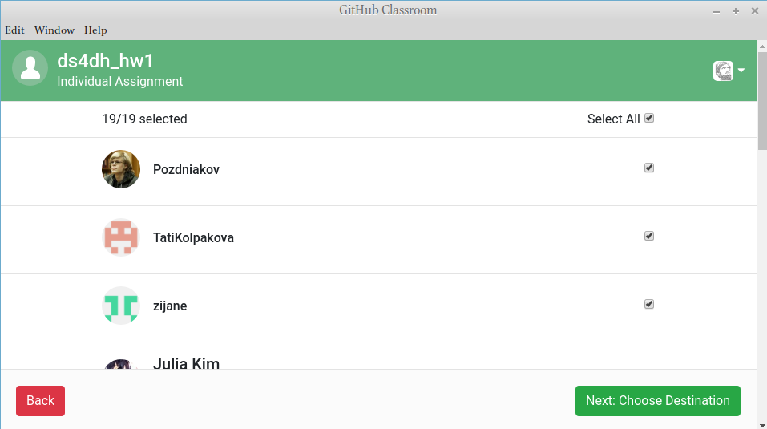

## Введение

Во время преподавания программирования и анализа данных на преподавателя действуют две противоборствующие силы:

* с одной стороны хочется проверить знания студентов какой-то осмысленной задачей;
* с другой стороны не хочется тратить на проверку однотипных работ студентов много времени.

Если пересилит первая сила, то преподаватель даст каждому студенту индивидуальное задание и потратит неимоверное количество времени на его проверку. Если пересилит вторая сила, то преподаватель даст что-то простое вроде гугл-формы с готовыми заранее ответами, которую будет легко проверять автоматически, однако достаточно сложно будет понять связь между реальными знаниями и результатами теста. В данном тексте я попробую показать, как можно использовать [Github classroom](https://classroom.github.com) для того, чтобы найти какой-то баланс между этими двумя крайностями. Я никак не связан с GitHub как фирмой и не получаю от нее никаких бонусов, кроме приведенных в статье. 

## Создание задания в Github classroom
[Github classroom](https://classroom.github.com) -- это открытая и бесплатная платформа, которая позволяет использовать инфроструктуру GitHub в учебных (и, наверное, каких-нибудь других) целях. Для получения доступа к базовым возможностям нужно лишь создать организацию на GitHub. 


После этого в Github Classroom нужно нажать зеленую кнопку `New classroom` и добавить созданную организацию :


После этого создается так называемый Classroom. Нажав на зеленую кнопку `New Assignment`, становятся доступны следующие возможности по созданию задания:

* можно выбрать хотите ли вы чтобы задание было индивидуальным или групповым


* можно использовать любой созданный в организации репозиторий как основу для создаваемого задания (в примере это `2019_2020_ds4dh_hw1_github`)
* поставить дедлайн задания
* выбрать шаблон для называния новых репозиториев (в примере это `ds4dh-hw1`)
* выбрать права студентов (могут ли они удалять репозиторий и т. п.)
* получить invite-ссылку, которую можно расшарить среди студентов


Каждый студент, кликая на ссылку автоматически форкает репозиторий в новый репозиторий в вашей организации с фиксированным именем, например, `ds4dh-hw1-c0chonnet`, и может дальше работать. 


Студенты могут выполнять задания вне зависимости от своего знакомства с `git`: на GitHub сделали достаточно понятный интерфейс, который позволяет и редактировать файлы,  и создавать папки, и закачивать свои файлы.

## Сбор заданий
После того как студенты завершили свои задания настало время все это собрать и проверить. Github сделали какое-то Desktop приложение Classroom assistant, которому можно дать ссылку на ваше задание на Github Classroom (на просто ссылку на репозиторий на Gitghub), а он сделает список студенческих репозиотриев, ассоциированных с данным заданием, и даже предложить все эти студенческие репозитории скачать. Насколько эта праграмма нужна, я не знаю, в целом можно было бы написать свой скрипт, который бы делал то же самое. Side effect установки этой программы на моем компьюетере стало то, что он стал пытаться открывать при помощи Classroom assistant все `.html` файлы.



## Проверка заданий
В результате предыдущих шагов на Вашем компьютере где-то появляется папка с репозиториями всех студентов, выполнивших задание. Ее содержимое в моем случае выглядит как-то так:

```{bash, echo = FALSE}
cd /home/agricolamz/Desktop/ds4dh_hw1-10-28-2019-04-09-14
tree -L 2 | tail -n 11
```

Я писал задание в `README.md`, в результате оно сразу было видно студентам. Можно также попросить студентов в этом же `README.md` представиться, если Вам недостаточно ника на гитхабе.

Первым шагом я решил собрать ники всех студентов:

```{r}
# код на R
list.files("/home/agricolamz/Desktop/ds4dh_hw1-10-28-2019-04-09-14/")
```

Дальше, можно собрать информацию про то, кто сколько коммитов сделал:
```{bash}
# Код на bash
cd /home/agricolamz/Desktop/ds4dh_hw1-10-28-2019-04-09-14/zijane
git log --pretty=oneline | wc -l
```

Этот код легко обернуть в цикл и сделать в R табличку с никами и 

```{r}
library(tidyverse, warn.conflicts = FALSE)
users <- list.files("/home/agricolamz/Desktop/ds4dh_hw1-10-28-2019-04-09-14")

sapply(users, function(x){
  system(paste0("cd /home/agricolamz/Desktop/ds4dh_hw1-10-28-2019-04-09-14/", 
                x, 
                "; git log --pretty=oneline | wc -l"), intern = TRUE)
}) %>% 
  as.integer() %>% 
  tibble(users, n_commits_1 = .) ->
  results

results
```

Аналогичным образом нужно обходить репозитории студентов и смотреть, как они выполнили задания.

## Оценки
Представим себе, что мы оценили работы (обычно я не ставлю оценки рандомизатором):

```{r}
set.seed(42)
results %>% 
  mutate(grade = round(rnorm(18, mean = 7, sd = 2))) ->
  results  
results
```

Теперь я могу пройтись по `README.md` файлам студентов и добавить им туда оценку:

```{r, eval = FALSE}
sapply(seq_along(users), function(x){
  tryCatch(
    t <- read_lines(paste0(users[x], "/README.md")),
    error = function(e) {
      paste("ERROR:", conditionMessage(e))
    }
  )
  if("t" %in% ls()){
    write_lines(x = c(t, paste("\n## Оценка:", results$grade[x])), 
                path = paste0(users[x], "/README.md"))
  } else {
    write_lines(x = paste("\n## Оценка:", results$grade[x]), 
                path = paste0(users[x], "/README.md"))
  }
})
```

Я использую достаточно громоздкую конструкцию, в которой я пытаюсь прочитать файл `README.md` (студенты ведь могут и удалить этот файл!), если файл существует, я добавляю к нему последнюю строку с оценкой, если нет -- создаю этот файл с соответствующей строкой.

На следующем этапе нужно закомитить изменения в студенческие репозитории. Но тут не все просто: дело в том, что когда Classroom asisstant собирал репозитории, он их клонировал черех https, поэтому, когда Вам захочется закоммитить изменения, Github будет спрашивать логин и пароль. А вот если Вы настроили ssh, то поменяв ссылку, Вы сможете коммитить без пароля.

```{r, eval = FALSE}
sapply(users, function(x){
  system(paste0("cd ", x, "/; ",
                "git remote set-url origin git@github.com:r-classes/ds4dh-hw1-", x, "\\.git; ",
                'git add -A; git commit -m "add grade"; git push origin master'))
})
```

Важный комментарий, на случай если Вы забыли:

* `r-classes` -- это название вашей организации
* `ds4dh-hw1-` -- приставка вашего задания

## Приватные репозитории
Какой смысл заданий, если студент может в любой момент пойти в соседний репозиторий и посмотреть, что сделал сосед даже без его ведома? Для этого Github предлагает акцию: все студенты и преподаватели имеют возможность создавать приватные репозитории, если докажут свой статус. Ссылка на место, где можно оставлять заявку есть под подписью `Private`. Когда Вам одобрят заявку, перед Вами появится какое-то вот такая страница [Github Education Benefits](https://education.github.com/benefits), где нужно выбрать свою организацию и проапгрейдить ее (ср. r-classes с другими организациями):


После этого у Вас появится возможность создавать приватные репозитории и приватные задания, т. е. теперь студенты будут создавать приватные репозитории, которые не видны никому кроме администратора/ов организации и студента.